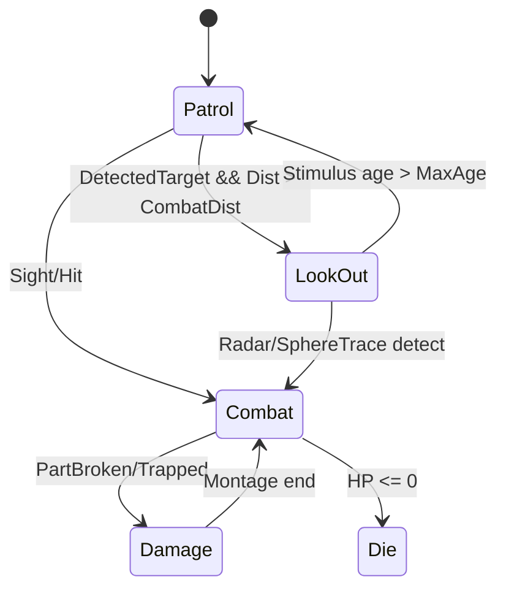
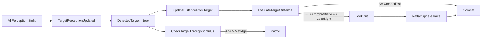

# VERTICAL (UE5 / C++)

Unreal Engine 5.5 기반 3인칭 보스전 액션 프로젝트. 보스 AI(FSM + Perception),
패턴 공격, 부위 파괴, UI/게임 플로우를 구현.

## 개요
- 장르: 3인칭 액션
- 플랫폼: PC
- 기간: 2025.02 ~ 2025.03 
- 인원: 2명
- 기술: UE 5.5, C++, Blueprint, UMG, AI Perception
- 내 역할: 보스 AI, 게임 플로우
- 입력 바인딩: `/Game/Input/IMC_Player` (TODO: 실제 키 매핑 문서화)
- 보스 전투 맵/시작 레벨: TODO (확인 방법: Project Settings > Maps & Modes)

## 핵심 기술 요약
- ActorComponent 기반 FSM + State 패턴 + `TMap` State Pool 구조.
- AI Perception 시야 감지 + 거리 기반 상태 전환(정찰/경계/전투).
- 패턴 공격: 머신건(원형 랜덤 좌표), 디스크 런처(이동→락온 트레일→미사일),
  근접(꼬리치기/돌진 BoxTrace).
- 부위 파괴: 무기 액터 부착/분리 + 파괴 시 기능 비활성화 + 약점 머티리얼 표시.
- 오브젝트 풀링: 머신건 탄환 재사용으로 스폰 비용 완화.
- Delegate 기반 UI/게임 플로우: 데미지 UI, Game Over/Clear 처리.

## 시스템 상세
### FSM 아키텍처 (ActorComponent + State Pool)
- `UThunderJawFSM`이 보스의 상태를 관리하며 `TMap<EBossState, UBossBaseState*>`로
  상태 인스턴스를 풀링합니다.
- 상태 확장 방법: `EBossState` 추가 → `UBossBaseState` 파생 클래스 구현 →
  `InitStatePool()`에 등록.
- `bIsLevelSequenceEnd` 플래그가 `false`이면 FSM/AI Tick이 멈춰 연출 종료 시점에
  전투가 시작되도록 설계되어 있습니다.

<!-- Diagram: FSM State Transition / Docs/Diagrams/fsm_state.mmd -->


파일: `Source/Project_V/Private/Boss/ThunderJawFSM.cpp` - `UThunderJawFSM::InitStatePool()`
```cpp
StatePool.Add(EBossState::Combat, NewObject<UBossCombatState>(this, UBossCombatState::StaticClass()));
StatePool[EBossState::Combat]->BossState = EBossState::Combat;
```

### 감지 시스템 (AI Perception)
- `UAIPerceptionComponent`의 Sight 설정으로 탐지 반경/각도/유지 시간을 관리합니다.
- 탐지 후 `DetectedTarget`이 켜지면 거리/방향 평가로 전투/경계 상태를 전환합니다.

| 항목 | 값 | 근거 |
| --- | --- | --- |
| DetectDist | 3600 | `Source/Project_V/Public/Boss/ThunderJawAIController.h` |
| CombatDist | 1800 | `Source/Project_V/Public/Boss/ThunderJawAIController.h` |
| LoseSightRadius | 4600 | `ThunderJawAIController.cpp` (DetectDist + 1000) |
| FOV | 45 deg | `ThunderJawAIController.cpp` |
| MaxAge | 100 | `ThunderJawAIController.cpp` |

<!-- Diagram: Perception -> Decision -> State / Docs/Diagrams/perception_flow.mmd -->


파일: `Source/Project_V/Private/Boss/ThunderJawAIController.cpp` - `AThunderJawAIController::InitComponent()`
```cpp
SightConfig->SightRadius = DetectDist;
SightConfig->LoseSightRadius = DetectDist + 1000;
SightConfig->PeripheralVisionAngleDegrees = 45.0f;
SightConfig->SetMaxAge(100.0f);
```

### 공격/패턴 시스템
- 거리 기준 패턴 선택: `MeleeAttackDist(1000)` 이하 근접, `RangeAttackDist(2500)` 이하
  원거리, 그 외 추격.
- 패턴 선택 시 무기 파괴 여부를 확인해 불가능한 패턴을 회피합니다.
- `FacingDot`으로 전/후방 판정 및 회전 후 패턴 실행을 제어합니다.

| 항목 | 값 | 근거 |
| --- | --- | --- |
| MeleeAttackDist | 1000 | `Source/Project_V/Public/Boss/ThunderJaw.h` |
| RangeAttackDist | 2500 | `Source/Project_V/Public/Boss/ThunderJaw.h` |
| MachineGunDelay | 0.1s | `BossCombatState.h` |
| DiscLauncherDelay | 1.0s | `BossCombatState.h` |
| ChargeTime | 2.0s | `BossCombatState.h` |

- 머신건: 원형 랜덤 좌표 기반 탄도 계산(삼각함수).
- 디스크 런처: 디스크 이동 → 락온 트레일 → 미사일 발사(타이머 기반).
- 근접: 꼬리치기/돌진 BoxTrace로 히트 판정.

파일: `Source/Project_V/Private/Boss/Weapon/MachineGunBullet.cpp` - `AMachineGunBullet::GetRandomPointInCircle()`
```cpp
float RandomAngle = FMath::RandRange(0.0f, 2.0f * PI);
float RandomRadius = radius * FMath::Sqrt(FMath::FRand());
float X = centerPoint.X + RandomRadius * FMath::Cos(RandomAngle);
float Y = centerPoint.Y + RandomRadius * FMath::Sin(RandomAngle);
```

### 부위 파괴 시스템
- 머신건/디스크 런처를 별도 액터로 스폰 후 소켓에 부착.
- 부위 HP가 0 이하가 되면 `bIsBroken`으로 파괴 상태 전환.
- 파괴 시 분리 + 물리 시뮬레이션 + 파괴 연출/카메라 쉐이크 수행.
- 포커스 모드에서는 약점 머티리얼을 오버레이로 표시.

<!-- Screenshot: 부위 파괴 직후 분리/낙하 장면 / Docs/Media/vertical_part_break.png -->

파일: `Source/Project_V/Private/Boss/Weapon/BossWeapon.cpp` - `ABossWeapon::DamageWeaponHP()`
```cpp
CurrentHP -= Damage;
if (CurrentHP <= 0)
{
    bIsBroken = true;
}
```

### 오브젝트 풀링 (머신건 탄환)
- `BulletMaxCount`만큼 미리 생성해 `Magazine`에 보관.
- 발사 시 `Magazine[0]`을 사용하고, 종료 시 다시 배열에 반환합니다.
- 스폰/GC 비용을 줄여 연속 발사 구간의 프레임 안정성 확보를 목표로 했습니다.

<!-- Performance: 풀링 전후 프레임타임 비교 / Docs/Perf/pooling_before_after.png -->

파일: `Source/Project_V/Private/Boss/Weapon/MachineGunBullet.cpp` - `AMachineGunBullet::BackToMagazine()`
```cpp
SetBulletActive(false);
if (MachineGun)
{
    SetActorLocation(FVector(10000));
    MachineGun->Magazine.Add(this);
}
```

### Delegate 기반 UI/게임 플로우
- 보스 피격 시 `FFloatingDamage`로 데미지 UI 트리거.
- 플레이어 사망/보스 처치 시 `FShowGameStateUI`로 Game Over/Clear UI 트리거.
- UI 위젯 바인딩은 Blueprint에서 연결되어 있을 가능성이 큽니다. (TODO: WBP 확인)

<!-- Diagram: GameFlow Delegate Wiring / Docs/Diagrams/gameflow_delegate.mmd -->

파일: `Source/Project_V/Private/Boss/ThunderJaw.cpp` - `AThunderJaw::BossTakeDamage()`
```cpp
FloatingDamage.Broadcast(Damage);
```

파일: `Source/Project_V/Private/Player/PlayCharacter.cpp` - `APlayCharacter::GameOver()`
```cpp
ShowGameStateUI.Broadcast(false);
```

## 트러블슈팅/개선 사례
- 문제: 머신건 연속 발사 시 Spawn/Destroy 비용으로 프레임 드랍 가능.
  원인: 발사마다 새 탄환 생성이 필요.
  해결: `Magazine` 풀 + `BackToMagazine()` 재사용 구조 적용.
  결과: Spawn 호출 최소화, 프레임 안정성 개선. (TODO: Unreal Insights로 수치화)
- 문제: 무기 파괴 후에도 해당 패턴이 선택되어 불필요한 상태가 발생.
  원인: 패턴 선택 시 무기 존재 여부 고려 부족.
  해결: `MakeRandomRangeNum()`에서 무기 nullptr 조건으로 패턴 재선정,
        패턴 함수에서 nullptr 체크 후 조기 종료.
  결과: 파괴 후 패턴 전환 안정화. (TODO: 전투 로그/테스트 기록)
- 문제: 시야 상실 시 전투/정찰이 급격히 전환되어 AI가 튕기는 현상.
  원인: Perception Age 만료 직후 즉시 Patrol 전환.
  해결: `LookOut` 상태에서 Radar + SphereTrace 재탐색 후 전투 복귀.
  결과: 탐지 재시도 구간 확보로 전투 흐름 유지. (TODO: 재탐지 성공률 기록)

## 내가 기여한 부분
- 보스 FSM/상태 전환: `Source/Project_V/Public/Boss/ThunderJawFSM.h`,
  `Source/Project_V/Private/Boss/ThunderJawFSM.cpp`,
  `Source/Project_V/Public/Boss/State/*`
- 보스 AI Perception/전투 판단: `Source/Project_V/Public/Boss/ThunderJawAIController.h`,
  `Source/Project_V/Private/Boss/ThunderJawAIController.cpp`
- 공격 패턴/무기 시스템: `Source/Project_V/Public/Boss/Weapon/*`,
  `Source/Project_V/Private/Boss/Weapon/*`
- 게임 플로우(UI 연계): `Source/Project_V/Private/Boss/ThunderJaw.cpp`,
  `Source/Project_V/Private/Player/PlayCharacter.cpp`,
  `Source/Project_V/Private/UI/GameStateUI.cpp`

## 미디어/링크
- YouTube: TODO

<!-- Video: 디스크 런처 3단계 패턴 시연 / Docs/Media/disk_launcher_demo.mp4 -->
<!-- Video: 머신건 랜덤 스프레이 패턴 / Docs/Media/machinegun_spread_demo.mp4 -->
<!-- Screenshot: AI Perception Debug (시야 반경) / Docs/Media/perception_debug.png -->
<!-- Diagram: FSM State Transition / Docs/Diagrams/fsm_state.png -->

